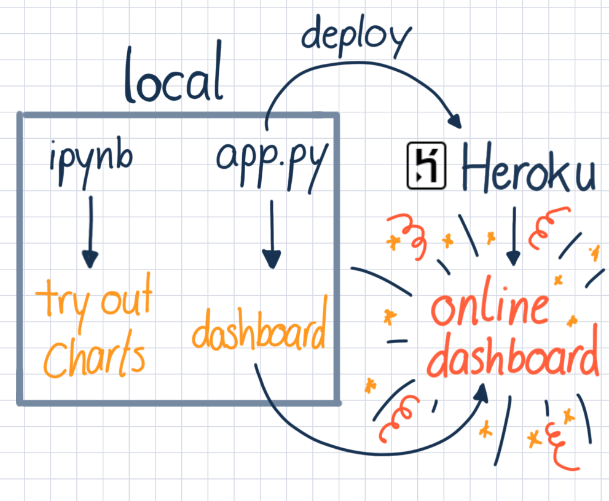

# ds-simple-plotly-dash-template

With this template you can create a simple repo to create a plotly-dash that can be deployed on heroku.
For a cool list of resources check [awesome dash](https://github.com/ucg8j/awesome-dash)!

## Aim

The aim of this template is to give a starting point to set-up an easy plotly dash and to employ it locally and to the internet.
Also included are links to additional resources.

## Getting started

Don't clone this repository. It's a template: create your own repository by using "use this template".

### What is in this repository

| File                          |                                                         |
| ----------------------------- | ------------------------------------------------------- |
| 01_notebook_plotly_dash.ipynb | First glance at the dash syntax                         |
| app.py                        | Py-File which contains the dash for deployment           |
| Procfile                      | Procfile, needed by Heroku to know how to run your app  |
| Runtime                       | Required for deployment, to use specific python version |
| requirements.txt              | libraries needed by your app                            |

## The next steps

1. Set up the environment
2. Work in notebook to get acquainted with dash plots
3. Work in app.py-File to create a dash
4. Check if Dashboard is working locally with

- ` $ python app.py`
- ` $ gunicorn app:server`

6. Deploy to Heroku
7. Enjoy the result

This little graph should help you clarify the steps you need to take until your online dashboard is ready.

(Delete *Heroku-Dashboard.png* when using this repo as template :) )

---
## Setup information

### Requirements:

- python = 3.9.11 (you can install it with `pyenv install 3.9.11`)

Setup environment with:

```console
$ make setup
```

There are two requirement files in this template: 
1. **requirements_dev.txt** This is the requirements file you can use locally to set everything up and develop the dashboard. You can add as much here as you want to. 
2. **requirements.txt** This is the requirements that Heroku uses. Because Memory for the App is very limited it should not contain the development environment (e.g. jupyter) and as few libraries as possible.

You should work with python 3.9.11, this is the version that Heroku is currently (May 2022, check heroku documentation for updates) using .

## General Tips for deployment of dash to Heroku

### Prior to deployment on Heroku

- Make sure you clean up, process and strip down the data as much as you can first.
- You can only use about 500MB of memory on Heroku, so don't waste space.
- Test your app locally thoroughly first. Use an environment that uses the "requirements.txt" for this so you are using the same packages as will be used on Heroku.

You should test everything locally with
` $ python app.py` and ` $ gunicorn app:server`
Make sure you restart your server (locally) so all your changes take effect.

Make sure you have these three files in the repo:

1. Runtime.txt
2. requirements.txt
3. Procfile

### Deployment to Heroku

The General steps are:

1. First you need to login or create an Account on [Heroku](https://Heroku.com)
2. click on New -> New Apps (on the right side)
3. Pick an unique name, this is gonna be reflected in your apps URL
4. Select europe
5. Use the github connection (allow and set this up if required)
6. Pick your repository
7. Select the branch (you should have a specific repository for the visualization or, at least, a specific branch)
8. Hit deploy and wait for the build
9. Hit view and
10. _Enjoy!_
